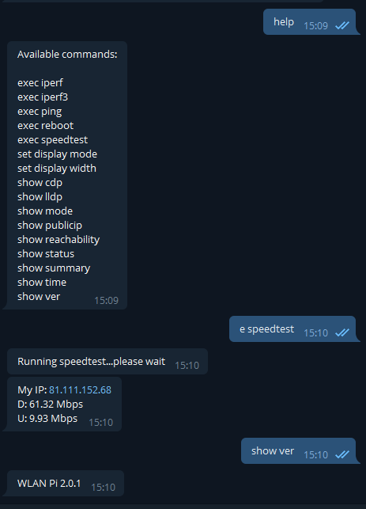

# wlanpi-chat-bot
A Chatbot Interface for the WLAN Pi to allow remote administration

__NOTE: This is alpha code__

Install notes on WLAN Pi v2.0.1 image
=====================================

1. Install pre-req Python modules:
```
    sudo pip3 install psutil netifaces
```
2. SSH to the WLAN Pi

3. Clone the bot Github repo:

    `sudo git clone https://github.com/wifinigel/wlanpi-chat-bot.git`

4. `cd wlanpi-chat-bot`

5. `sudo chmod 755 ./install.sh`

6. `sudo ./install.sh` (make sure you have you app token ready to enter when prompted by the script)

## Notes

1. If you want to start again by removing everything, go to the dir where you cloned the repo and uninstall using:

`sudo ./install.sh -r`

2. To clone the dev branch (if you're feeling brave), use the process above, but use the following clone command:

    `sudo git clone -b dev https://github.com/wifinigel/wlanpi-chat-bot.git`



## Troubleshooting

Check the service status:

```
sudo service wlanpi-chat-bot status
```

Restarting the wlanpi-chat-bot:

```
sudo service wlanpi-chat-bot restart
```
